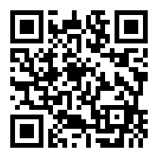
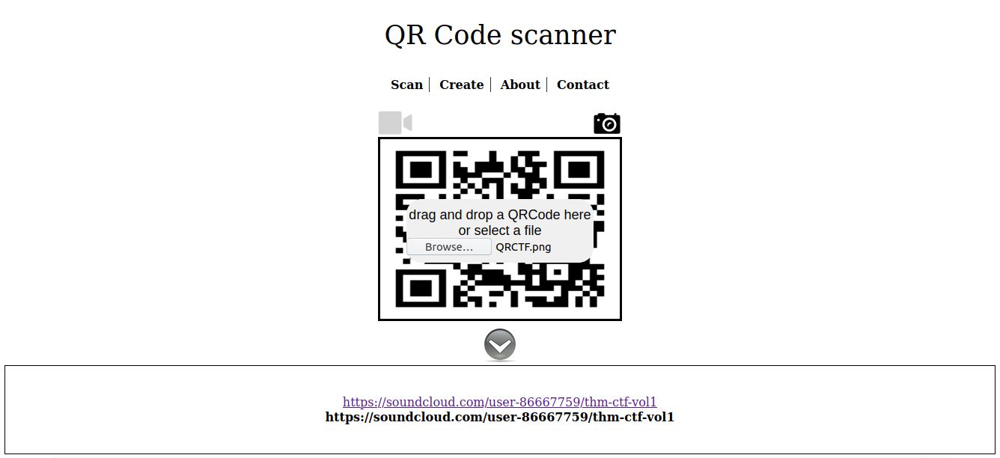
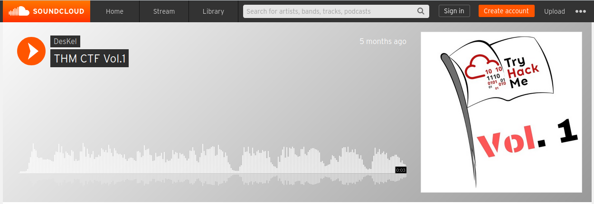

## A sounding QR
The main idea finding the flag is to use Stegsolver.

#### Step-1:
After downloading `QRCTF.png` from the cloud, it is natural to search online.

#### Step-2:

After scanning, we got a link to some sound cloud.

We get the following link from there:
[https://soundcloud.com/user-86667759/thm-ctf-vol1](https://soundcloud.com/user-86667759/thm-ctf-vol1)

#### Step-3:

An audio message is already recorded by bot. If we play it and listen it, we get the flag.

#### Step-4:
Finally the flag becomes:
`THM{SOUNDINGQR}`