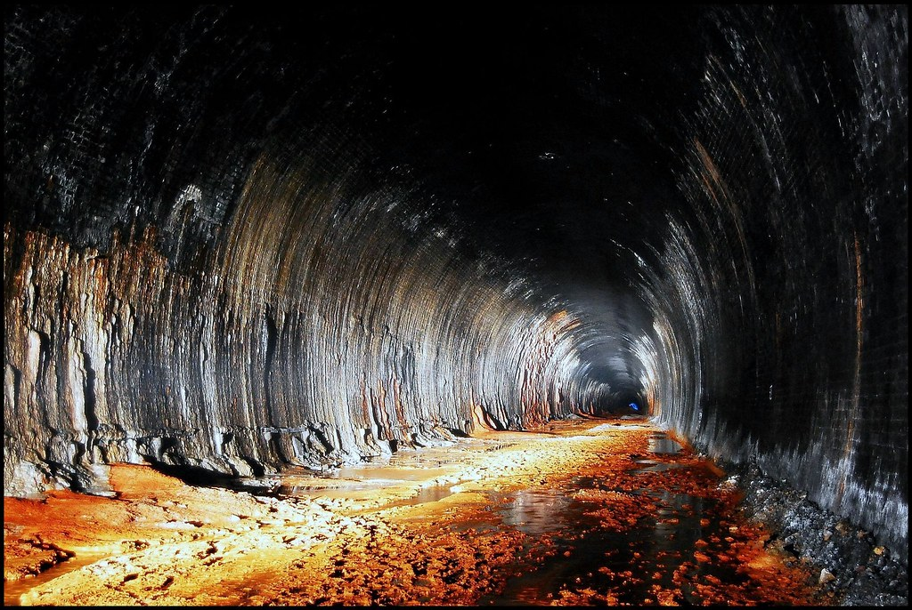

## Binary walk
The main idea finding the flag is to know Binwalk Extraction.

#### Step-1:
After I downloaded the image `hell.jpg`, my immediate thought was to check for the binwalk.



#### Step-2:
When command is `binwalk hell.jpg`, I got the following output:

```
DECIMAL       HEXADECIMAL     DESCRIPTION
--------------------------------------------------------------------------------
0             0x0             JPEG image data, JFIF standard 1.02
30            0x1E            TIFF image data, big-endian, offset of first image directory: 8
265845        0x40E75         Zip archive data, at least v2.0 to extract, uncompressed size: 69, name: hello_there.txt
266099        0x40F73         End of Zip archive, footer length: 22
```

#### Step-3:
Nothing much left now. Just extract it using `binwalk -e hell.jpg`

We get a new directory named `_hell.jpg.extracted`.

#### Step-4:
In there, I checked `hello_there.txt` and I had it.

#### Step-5:
Finally the flag becomes:
`THM{y0u_w4lk_m3_0u7}`