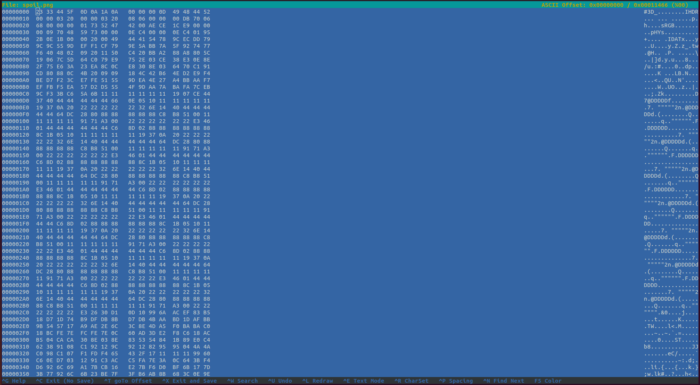

## Can you fix it?
The main idea finding the flag is fixing the corrupt image.

#### Step-1:
We have been given `spoil.png` which was corrupt.

#### Step-2:
So I then opened it in hexeditor by `hexeditor spoil.png`

`89 50 4E 47 0D 0A 1A 0A` - This is the png header format. Given to us was different
 
#### Step-3:
So I changed the header accordingly.

#### Step-4:
After saving the change, we get the new fixed file:

#### Step-5:
Finally the flag becomes:
`THM{y35_w3_c4n}`