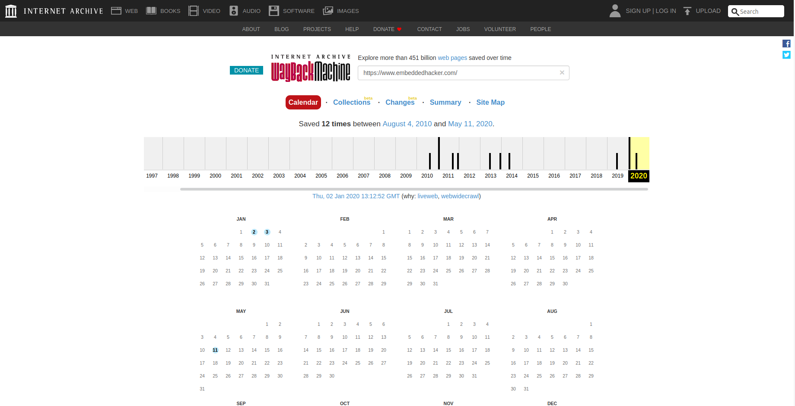
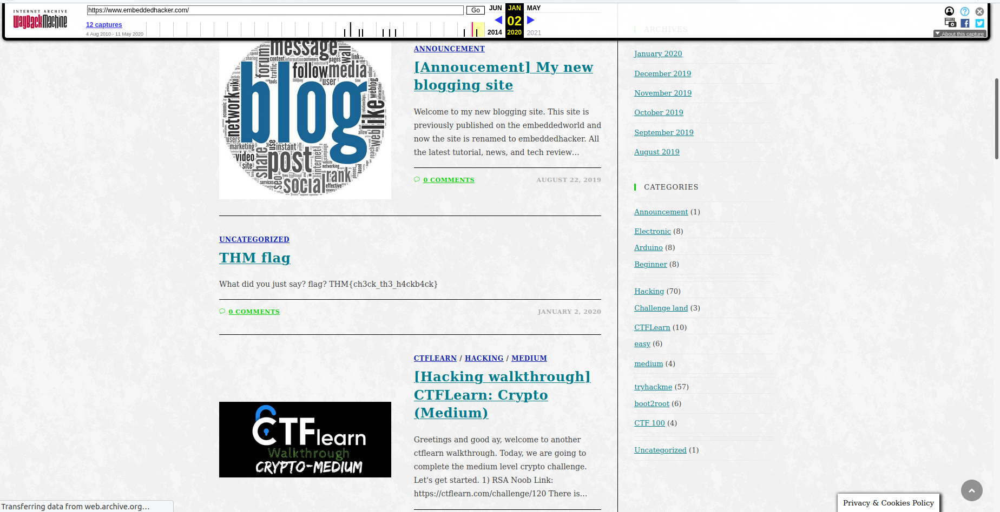

## Dig up the past
The main idea finding the flag is exploring the past changes on the website.

#### Step-1:
We must know about the information about the changes in the websites can be done from here: 
web.archive.org

#### Step-2:

After we search for our target website: https://www.embeddedhacker.com/

#### Step-3:

After selecting the given date: 2 January 2020, we get to the following link:

#### Step-4:

It will lead to the webpage: 
https://web.archive.org/web/20200102131252/https://www.embeddedhacker.com/

#### Step-5:
Finally the flag becomes:
`THM{ch3ck_th3_h4ckb4ck}`