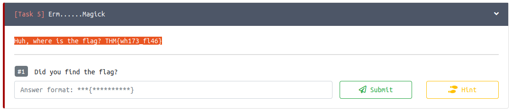

## Erm......Magick
The main idea finding the flag is just read the hint.

#### Step-1:
The flag is in the question itself. Nothing much to write here. Just need to select/highlight question.

#### Step-2:
Finally the flag becomes:
`THM{500n3r_0r_l473r_17_15_0ur_7urn}`