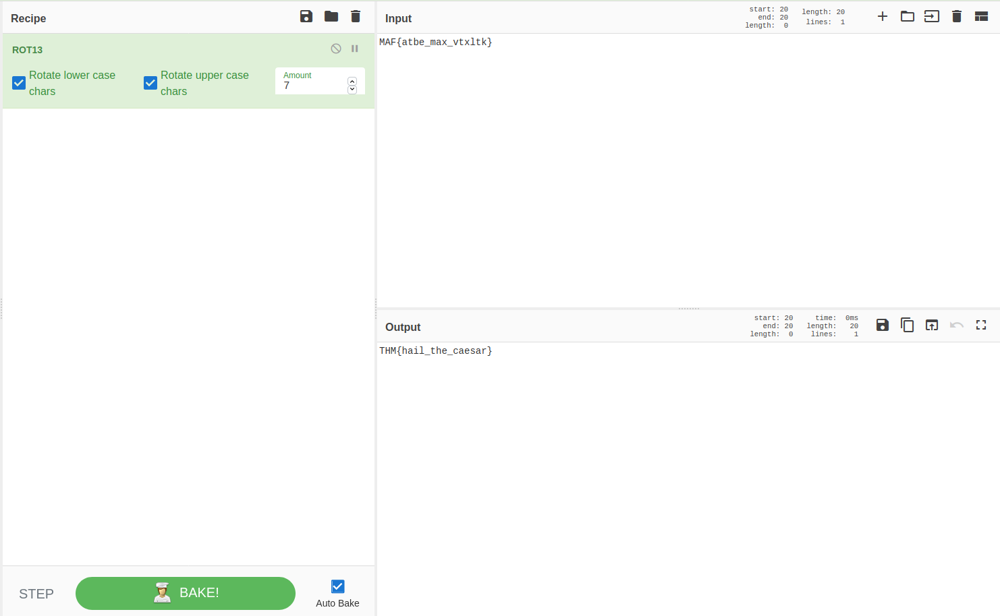

## Left or right
The main idea finding the flag is just knowing variable ROT13 method.

#### Step-1:
Given text `MAF{atbe_max_vtxltk}`, we need to decrypt this.

#### Step-2:
I directly visited this URL: https://gchq.github.io/CyberChef/#recipe=ROT13(true,true,14)

Since the question suggests to left/right, I put amount to be either 6 or 7.

 
#### Step-3:
Finally the flag becomes:
`THM{hail_the_caesar}`