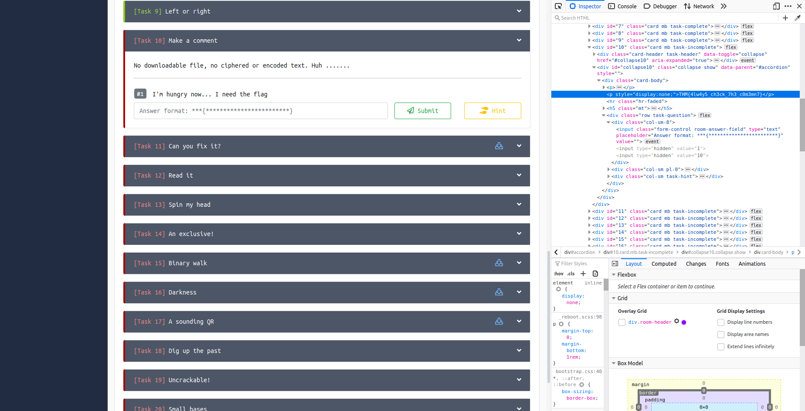

## Make a comment
The main idea finding the flag is just Inspecting Element.

#### Step-1:
As the question/hint suggests, we just need to check the HTML file. So I inspected the question.

#### Step-2:

 
#### Step-3:
Finally the flag becomes:
` THM{4lw4y5_ch3ck_7h3_c0m3mn7} `