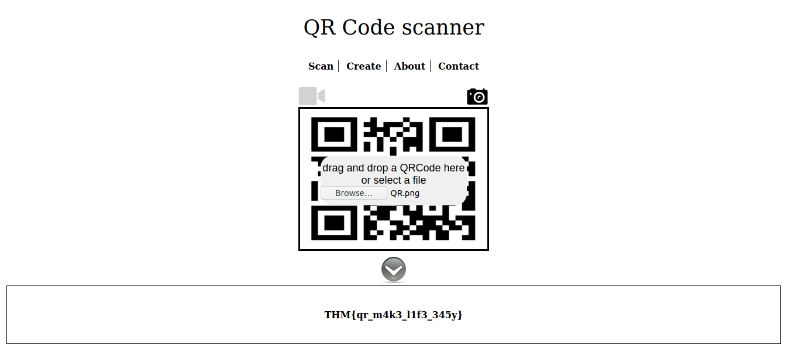

## QRrrrr
The main idea finding the flag is just scanning the QR code.

#### Step-1:
After downloading, `QR.png`, I immediately went online to search for Online QR scan.

#### Step-2:
I went to URL: https://webqr.com/

#### Step-3:
Finally the flag becomes:
`THM{qr_m4k3_l1f3_345y}`