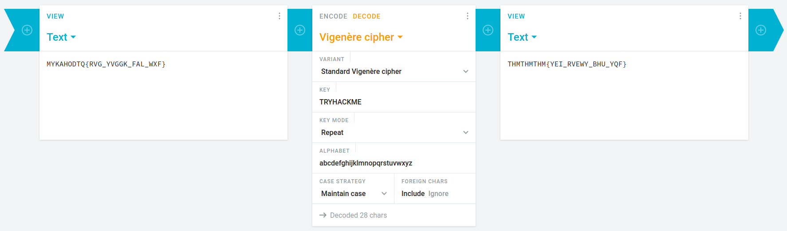
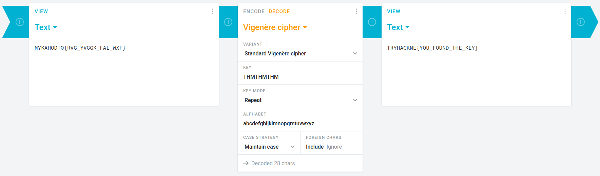

## Uncrackable!
The main idea finding the flag is using Vigenere Cipher.

#### Step-1:
After we are given message: `MYKAHODTQ{RVG_YVGGK_FAL_WXF}`

And we are given flag format as this: `TRYHACKME{FLAG IN ALL CAP}`

#### Step-2:

Now we use double decryption to get the flag. I used this procedure to get the flag.

#### Step-3:
Finally the flag becomes:
`TRYHACKME{YOU_FOUND_THE_KEY}`