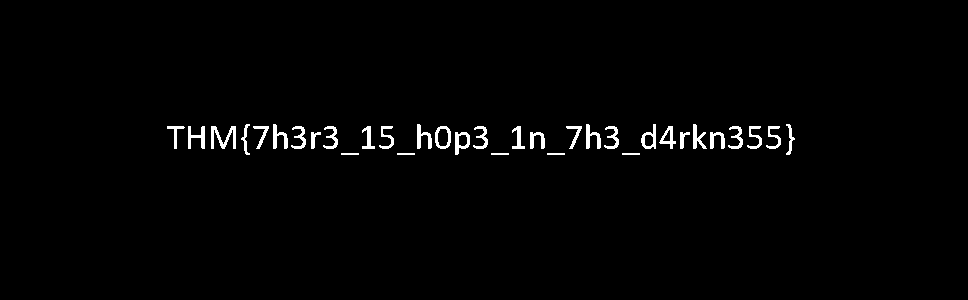

## Darkness
The main idea finding the flag is to use Stegsolver.

#### Step-1:
After downloading `dark.png` from the cloud, I tried all basic Forensics Techniques, but I got nothing.

#### Step-2:

I tried to use the Stegsolver application. For those who don't have it, can get the script from here:

[https://github.com/zardus/ctf-tools/tree/master/stegsolve](https://github.com/zardus/ctf-tools/tree/master/stegsolve)

After installation is complete, running `./stegsolver.jar` will launch the application.

#### Step-3:
I just kept on changing planes and in the Blue Plane 2 I got the flag.

#### Step-4:
Finally the flag becomes:
`THM{7h3r3_15_h0p3_1n_7h3_d4rkn355}`