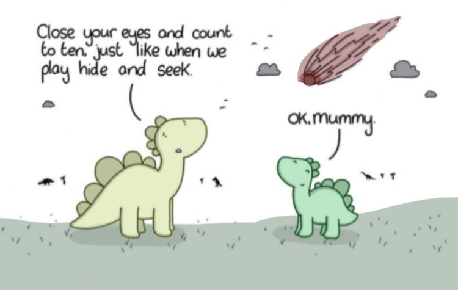

## Mon, are we going to be okay?
The main idea finding the flag is Steghide.

#### Step-1:
After downloading `Extinction.jpg`, I directly looked for Meta data.



I couldn't find anything in metadata.

#### Step-2:
So I tried Steghide as given in hint.

`steghide info Extinction.jpg` gave me some idea of other encrypted file.

```
"Extinction.jpg":
  format: jpeg
  capacity: 1.3 KB
Try to get information about embedded data ? (y/n) y
Enter passphrase: (Press Enter here)
  embedded file "Final_message.txt":
    size: 79.0 Byte
    encrypted: rijndael-128, cbc
    compressed: yes
```

As I have been doing this in past, `steghide extract -sf Extinction.jpg`, it gave me this output:

```
Enter passphrase: (Press Enter here)
wrote extracted data to "Final_message.txt".
```

#### Step-3:
The contents of `Final_message.txt` are as follows:

```
It going to be over soon. Sleep my child.

THM{500n3r_0r_l473r_17_15_0ur_7urn}
```

#### Step-4:
Finally the flag becomes:
`THM{500n3r_0r_l473r_17_15_0ur_7urn}`