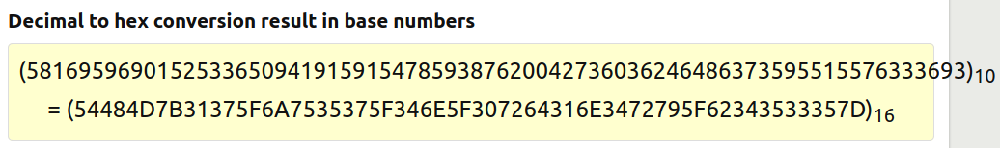
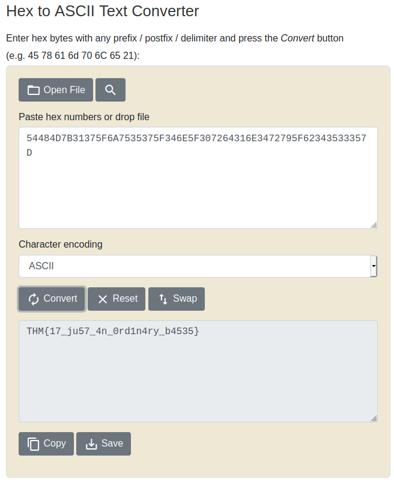

## Small bases
The main idea finding the flag is decrypting the multiple encryptions.

#### Step-1:
After we are given message: `581695969015253365094191591547859387620042736036246486373595515576333693`

I checked the hint, clearly it is given that Decimal -> Hex -> ASCII

#### Step-2:

Now we use double decryption to get the flag. I used this procedure to get the flag.

#### Step-3:
Finally the flag becomes:
`THM{17_ju57_4n_0rd1n4ry_b4535}`