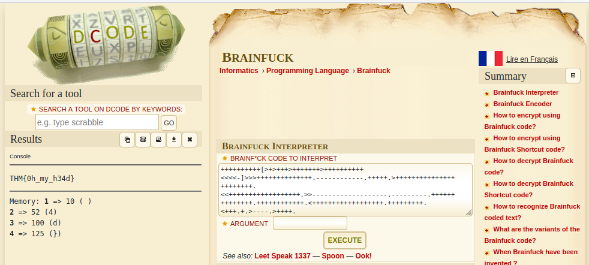

## Spin my head
The main idea finding the flag is to know Branifuck Ciphers.

#### Step-1:
Given message: 
```
++++++++++[>+>+++>+++++++>++++++++++<<<<-]>>>++++++++++++++.------------.+++++.>+++++++++++++++++++++++.<<++++++++++++++++++.>>-------------------.---------.++++++++++++++.++++++++++++.<++++++++++++++++++.+++++++++.<+++.+.>----.>++++.
```


#### Step-2:
I am kinda aware about these Brainfuck ciphers. So I directly visited this URL: 
https://www.dcode.fr/brainfuck-language



#### Step-3:
Finally the flag becomes:
`THM{0h_my_h34d}`