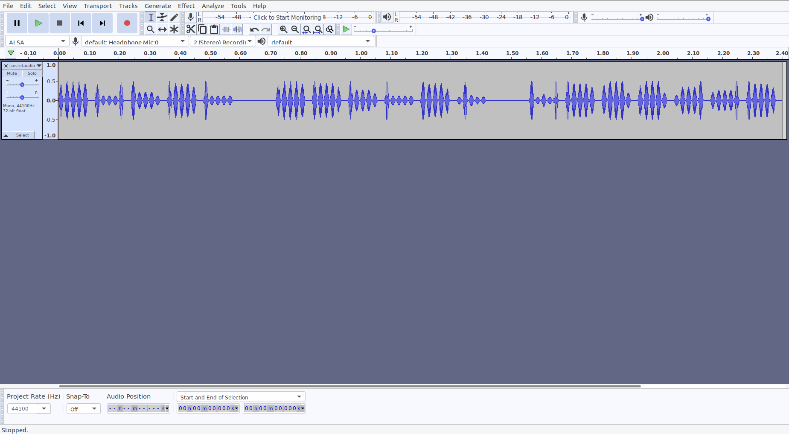
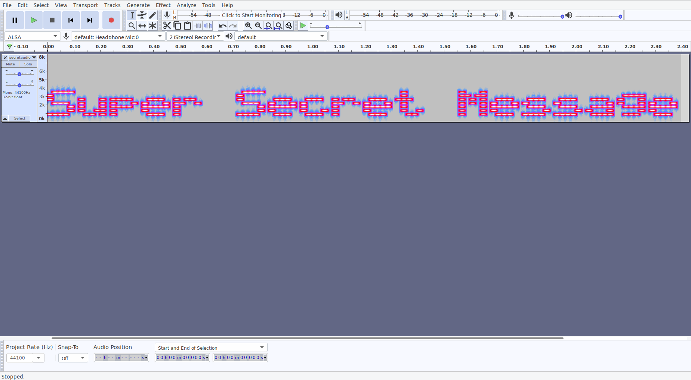

## c4ptur3-th3-fl4g

### Spectrograms
A spectrogram is a visual representation of the spectrum of frequencies of a signal as it varies with time. When applied to an audio signal, spectrograms are sometimes called sonographs, voiceprints, or voicegrams. When the data is represented in a 3D plot they may be called waterfalls.

Now if you have some idea on solving Stego challenges, this should be easy.

We are given `secretaudio.wav` and according to descriptions, it is said that we have to do something with the spectogram.

So, I opened this file in [Audacity](https://www.audacityteam.org/).

We are given this:

Get the view in Spectogram to get the flag. Please view [this](https://www.youtube.com/watch?v=VZbZa99ocPU) if you don't know how to do it.

Flag: `Super Secret Message`