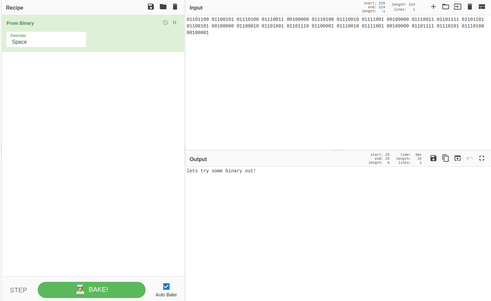
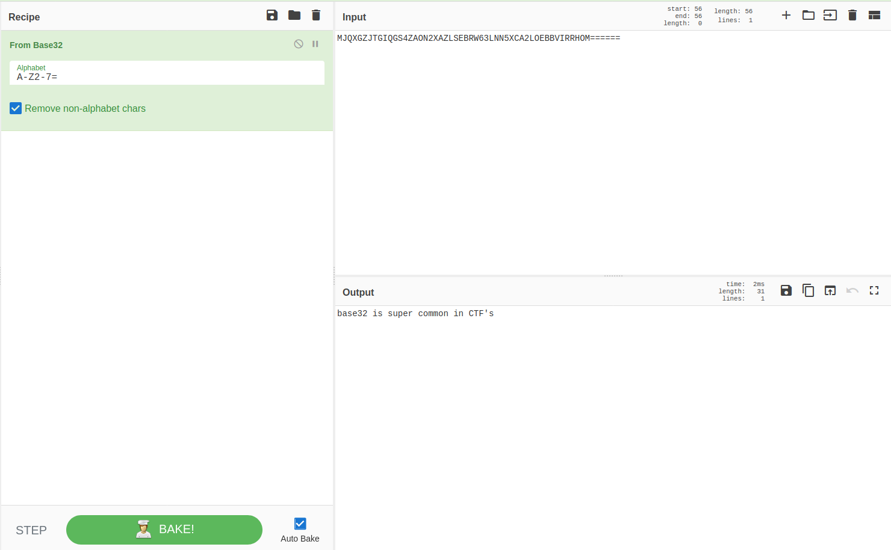
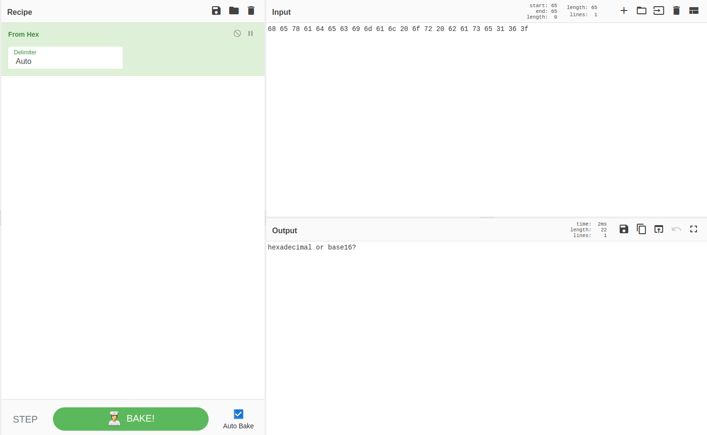
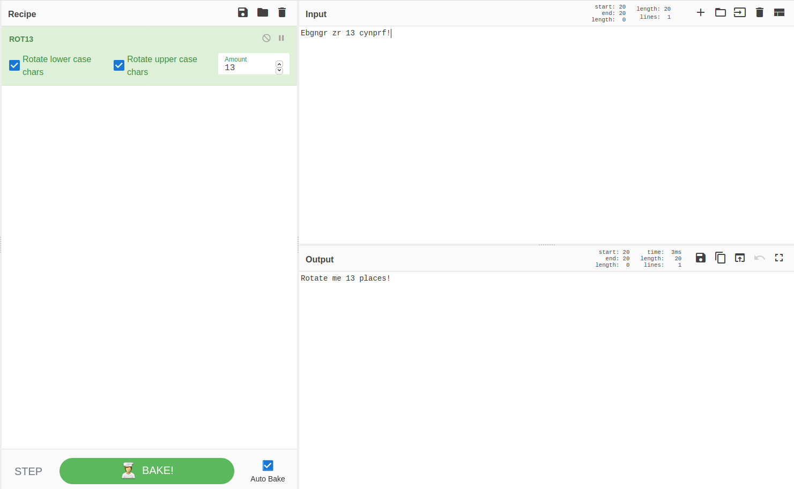
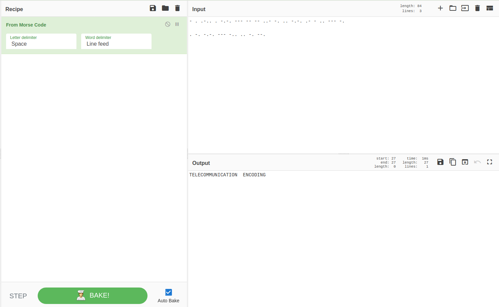
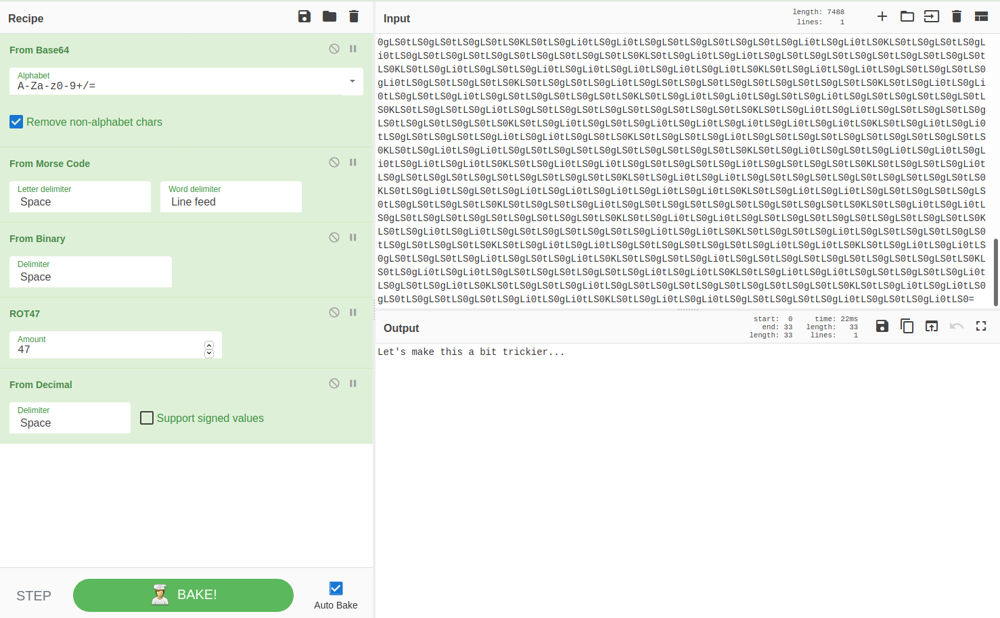

## c4ptur3-th3-fl4g

### Translation & Shifting
Most of these challenges have been solved using [CyberChef](http://icyberchef.com/).

#### #1:
Challenge: `c4n y0u c4p7u23 7h3 f149?`

You might want to read [this](https://en.wikipedia.org/wiki/Leet). 

Flag: `can you capture the flag?`


#### #2:
Challenge: `01101100 01100101 01110100 01110011 00100000 01110100 01110010 01111001 00100000 01110011 01101111 01101101 01100101 00100000 01100010 01101001 01101110 01100001 01110010 01111001 00100000 01101111 01110101 01110100 00100001`

This is simple Binary to text conversion.



Flag: `lets try some binary out!`

#### #3:
Challenge: `MJQXGZJTGIQGS4ZAON2XAZLSEBRW63LNN5XCA2LOEBBVIRRHOM======`

This is Base32 encryption (can be known by ==== in the tail).



Flag: `base32 is super common in CTF's`

#### #4:

Challenge: `RWFjaCBCYXNlNjQgZGlnaXQgcmVwcmVzZW50cyBleGFjdGx5IDYgYml0cyBvZiBkYXRhLg==`

This is a Base64 encryption (can be known by == in the tail).


Flag: `Each Base64 digit represents exactly 6 bits of data.`

#### #5:
Challenge: `68 65 78 61 64 65 63 69 6d 61 6c 20 6f 72 20 62 61 73 65 31 36 3f`

This is Hex encoding.



Flag: `hexadecimal or base16?`

#### #6:
Challenge: `Ebgngr zr 13 cynprf!`

That 13 should give us idea of ROT13 encryption.



Flag: `Rotate me 13 places!`


#### #7:
Challenge: `*@F DA:? >6 C:89E C@F?5 323J C:89E C@F?5 Wcf E:>6DX`

That capital letters with symbols should give us idea of ROT47 encryption.


Flag: `You spin me right round baby right round (47 times)`

#### #8:
Challenge: `- . .-.. . -.-. --- -- -- ..- -. .. -.-. .- - .. --- -.
. -. -.-. --- -.. .. -. --.`

This is Morse Code.



Flag: `TELECOMMUNICATION  ENCODING`

#### #9:
Challenge: `85 110 112 97 99 107 32 116 104 105 115 32 66 67 68`

This is encoded in Decimal encoding. 


Flag: `Unpack this BCD`


#### #10:
Challenge: 

```
LS0tLS0gLi0tLS0gLi0tLS0gLS0tLS0gLS0tLS0gLi0tLS0gLi0tLS0gLS0tLS0KLS0tLS0gLi0tLS0gLi0tLS0gLS0tLS0gLS0tLS0gLi0tLS0gLS0tLS0gLi0tLS0KLS0tLS0gLS0tLS0gLi0tLS0gLS0tLS0gLS0tLS0gLS0tLS0gLS0tLS0gLS0tLS0KLS0tLS0gLi0tLS0gLi0tLS0gLS0tLS0gLS0tLS0gLS0tLS0gLS0tLS0gLS0tLS0KLS0tLS0gLi0tLS0gLS0tLS0gLi0tLS0gLi0tLS0gLi0tLS0gLi0tLS0gLi0tLS0KLS0tLS0gLi0tLS0gLi0tLS0gLS0tLS0gLS0tLS0gLS0tLS0gLS0tLS0gLS0tLS0KLS0tLS0gLS0tLS0gLi0tLS0gLS0tLS0gLS0tLS0gLS0tLS0gLS0tLS0gLS0tLS0KLS0tLS0gLi0tLS0gLi0tLS0gLS0tLS0gLS0tLS0gLS0tLS0gLS0tLS0gLS0tLS0KLS0tLS0gLi0tLS0gLi0tLS0gLS0tLS0gLS0tLS0gLS0tLS0gLS0tLS0gLS0tLS0KLS0tLS0gLi0tLS0gLi0tLS0gLS0tLS0gLS0tLS0gLi0tLS0gLS0tLS0gLi0tLS0KLS0tLS0gLS0tLS0gLi0tLS0gLS0tLS0gLS0tLS0gLS0tLS0gLS0tLS0gLS0tLS0KLS0tLS0gLi0tLS0gLi0tLS0gLS0tLS0gLS0tLS0gLS0tLS0gLi0tLS0gLS0tLS0KLS0tLS0gLi0tLS0gLi0tLS0gLS0tLS0gLi0tLS0gLS0tLS0gLS0tLS0gLS0tLS0KLS0tLS0gLS0tLS0gLi0tLS0gLS0tLS0gLS0tLS0gLS0tLS0gLS0tLS0gLS0tLS0KLS0tLS0gLi0tLS0gLi0tLS0gLS0tLS0gLS0tLS0gLS0tLS0gLS0tLS0gLS0tLS0KLS0tLS0gLi0tLS0gLi0tLS0gLS0tLS0gLS0tLS0gLS0tLS0gLS0tLS0gLS0tLS0KLS0tLS0gLi0tLS0gLi0tLS0gLS0tLS0gLS0tLS0gLi0tLS0gLS0tLS0gLS0tLS0KLS0tLS0gLS0tLS0gLi0tLS0gLS0tLS0gLS0tLS0gLS0tLS0gLS0tLS0gLS0tLS0KLS0tLS0gLi0tLS0gLi0tLS0gLS0tLS0gLS0tLS0gLS0tLS0gLi0tLS0gLS0tLS0KLS0tLS0gLi0tLS0gLi0tLS0gLS0tLS0gLS0tLS0gLS0tLS0gLS0tLS0gLi0tLS0KLS0tLS0gLS0tLS0gLi0tLS0gLS0tLS0gLS0tLS0gLS0tLS0gLS0tLS0gLS0tLS0KLS0tLS0gLi0tLS0gLi0tLS0gLS0tLS0gLS0tLS0gLS0tLS0gLS0tLS0gLS0tLS0KLS0tLS0gLi0tLS0gLS0tLS0gLi0tLS0gLi0tLS0gLi0tLS0gLi0tLS0gLi0tLS0KLS0tLS0gLi0tLS0gLi0tLS0gLS0tLS0gLi0tLS0gLS0tLS0gLS0tLS0gLS0tLS0KLS0tLS0gLS0tLS0gLi0tLS0gLS0tLS0gLS0tLS0gLS0tLS0gLS0tLS0gLS0tLS0KLS0tLS0gLi0tLS0gLi0tLS0gLS0tLS0gLi0tLS0gLS0tLS0gLS0tLS0gLS0tLS0KLS0tLS0gLi0tLS0gLi0tLS0gLS0tLS0gLS0tLS0gLi0tLS0gLi0tLS0gLS0tLS0KLS0tLS0gLS0tLS0gLi0tLS0gLS0tLS0gLS0tLS0gLS0tLS0gLS0tLS0gLS0tLS0KLS0tLS0gLi0tLS0gLi0tLS0gLS0tLS0gLS0tLS0gLS0tLS0gLS0tLS0gLS0tLS0KLS0tLS0gLi0tLS0gLS0tLS0gLi0tLS0gLi0tLS0gLi0tLS0gLi0tLS0gLi0tLS0KLS0tLS0gLi0tLS0gLi0tLS0gLS0tLS0gLS0tLS0gLi0tLS0gLi0tLS0gLS0tLS0KLS0tLS0gLS0tLS0gLi0tLS0gLS0tLS0gLS0tLS0gLS0tLS0gLS0tLS0gLS0tLS0KLS0tLS0gLi0tLS0gLi0tLS0gLS0tLS0gLS0tLS0gLS0tLS0gLS0tLS0gLS0tLS0KLS0tLS0gLi0tLS0gLS0tLS0gLi0tLS0gLi0tLS0gLi0tLS0gLi0tLS0gLi0tLS0KLS0tLS0gLi0tLS0gLi0tLS0gLS0tLS0gLS0tLS0gLS0tLS0gLS0tLS0gLS0tLS0KLS0tLS0gLS0tLS0gLi0tLS0gLS0tLS0gLS0tLS0gLS0tLS0gLS0tLS0gLS0tLS0KLS0tLS0gLi0tLS0gLi0tLS0gLS0tLS0gLS0tLS0gLS0tLS0gLi0tLS0gLS0tLS0KLS0tLS0gLi0tLS0gLi0tLS0gLS0tLS0gLS0tLS0gLS0tLS0gLS0tLS0gLi0tLS0KLS0tLS0gLS0tLS0gLi0tLS0gLS0tLS0gLS0tLS0gLS0tLS0gLS0tLS0gLS0tLS0KLS0tLS0gLi0tLS0gLi0tLS0gLS0tLS0gLS0tLS0gLS0tLS0gLS0tLS0gLS0tLS0KLS0tLS0gLi0tLS0gLi0tLS0gLS0tLS0gLS0tLS0gLS0tLS0gLS0tLS0gLS0tLS0KLS0tLS0gLi0tLS0gLi0tLS0gLS0tLS0gLS0tLS0gLi0tLS0gLS0tLS0gLi0tLS0KLS0tLS0gLS0tLS0gLi0tLS0gLS0tLS0gLS0tLS0gLS0tLS0gLS0tLS0gLS0tLS0KLS0tLS0gLi0tLS0gLi0tLS0gLS0tLS0gLS0tLS0gLS0tLS0gLS0tLS0gLS0tLS0KLS0tLS0gLi0tLS0gLS0tLS0gLi0tLS0gLi0tLS0gLi0tLS0gLi0tLS0gLi0tLS0KLS0tLS0gLi0tLS0gLi0tLS0gLS0tLS0gLS0tLS0gLS0tLS0gLi0tLS0gLi0tLS0KLS0tLS0gLS0tLS0gLi0tLS0gLS0tLS0gLS0tLS0gLS0tLS0gLS0tLS0gLS0tLS0KLS0tLS0gLi0tLS0gLi0tLS0gLS0tLS0gLS0tLS0gLS0tLS0gLS0tLS0gLS0tLS0KLS0tLS0gLi0tLS0gLS0tLS0gLi0tLS0gLi0tLS0gLi0tLS0gLi0tLS0gLi0tLS0KLS0tLS0gLi0tLS0gLi0tLS0gLS0tLS0gLS0tLS0gLi0tLS0gLS0tLS0gLS0tLS0KLS0tLS0gLS0tLS0gLi0tLS0gLS0tLS0gLS0tLS0gLS0tLS0gLS0tLS0gLS0tLS0KLS0tLS0gLi0tLS0gLi0tLS0gLS0tLS0gLS0tLS0gLS0tLS0gLS0tLS0gLS0tLS0KLS0tLS0gLi0tLS0gLi0tLS0gLS0tLS0gLS0tLS0gLS0tLS0gLS0tLS0gLS0tLS0KLS0tLS0gLi0tLS0gLi0tLS0gLS0tLS0gLS0tLS0gLi0tLS0gLS0tLS0gLS0tLS0KLS0tLS0gLS0tLS0gLi0tLS0gLS0tLS0gLS0tLS0gLS0tLS0gLS0tLS0gLS0tLS0KLS0tLS0gLi0tLS0gLi0tLS0gLS0tLS0gLS0tLS0gLS0tLS0gLi0tLS0gLS0tLS0KLS0tLS0gLi0tLS0gLi0tLS0gLS0tLS0gLS0tLS0gLS0tLS0gLS0tLS0gLi0tLS0KLS0tLS0gLS0tLS0gLi0tLS0gLS0tLS0gLS0tLS0gLS0tLS0gLS0tLS0gLS0tLS0KLS0tLS0gLi0tLS0gLi0tLS0gLS0tLS0gLi0tLS0gLS0tLS0gLS0tLS0gLS0tLS0KLS0tLS0gLi0tLS0gLi0tLS0gLS0tLS0gLS0tLS0gLi0tLS0gLi0tLS0gLS0tLS0KLS0tLS0gLS0tLS0gLi0tLS0gLS0tLS0gLS0tLS0gLS0tLS0gLS0tLS0gLS0tLS0KLS0tLS0gLi0tLS0gLi0tLS0gLS0tLS0gLS0tLS0gLS0tLS0gLi0tLS0gLS0tLS0KLS0tLS0gLi0tLS0gLi0tLS0gLS0tLS0gLS0tLS0gLS0tLS0gLS0tLS0gLi0tLS0KLS0tLS0gLS0tLS0gLi0tLS0gLS0tLS0gLS0tLS0gLS0tLS0gLS0tLS0gLS0tLS0KLS0tLS0gLi0tLS0gLi0tLS0gLS0tLS0gLi0tLS0gLS0tLS0gLS0tLS0gLS0tLS0KLS0tLS0gLi0tLS0gLi0tLS0gLS0tLS0gLS0tLS0gLi0tLS0gLi0tLS0gLi0tLS0KLS0tLS0gLS0tLS0gLi0tLS0gLS0tLS0gLS0tLS0gLS0tLS0gLS0tLS0gLS0tLS0KLS0tLS0gLi0tLS0gLi0tLS0gLS0tLS0gLS0tLS0gLS0tLS0gLS0tLS0gLS0tLS0KLS0tLS0gLi0tLS0gLS0tLS0gLi0tLS0gLi0tLS0gLi0tLS0gLi0tLS0gLi0tLS0KLS0tLS0gLi0tLS0gLi0tLS0gLS0tLS0gLS0tLS0gLi0tLS0gLS0tLS0gLS0tLS0KLS0tLS0gLS0tLS0gLi0tLS0gLS0tLS0gLS0tLS0gLS0tLS0gLS0tLS0gLS0tLS0KLS0tLS0gLi0tLS0gLi0tLS0gLS0tLS0gLS0tLS0gLS0tLS0gLS0tLS0gLS0tLS0KLS0tLS0gLi0tLS0gLi0tLS0gLS0tLS0gLS0tLS0gLS0tLS0gLS0tLS0gLS0tLS0KLS0tLS0gLi0tLS0gLi0tLS0gLS0tLS0gLS0tLS0gLi0tLS0gLS0tLS0gLi0tLS0KLS0tLS0gLS0tLS0gLi0tLS0gLS0tLS0gLS0tLS0gLS0tLS0gLS0tLS0gLS0tLS0KLS0tLS0gLi0tLS0gLi0tLS0gLS0tLS0gLS0tLS0gLS0tLS0gLi0tLS0gLS0tLS0KLS0tLS0gLi0tLS0gLi0tLS0gLS0tLS0gLS0tLS0gLS0tLS0gLS0tLS0gLi0tLS0KLS0tLS0gLS0tLS0gLi0tLS0gLS0tLS0gLS0tLS0gLS0tLS0gLS0tLS0gLS0tLS0KLS0tLS0gLi0tLS0gLi0tLS0gLS0tLS0gLS0tLS0gLS0tLS0gLS0tLS0gLS0tLS0KLS0tLS0gLi0tLS0gLi0tLS0gLS0tLS0gLS0tLS0gLS0tLS0gLS0tLS0gLS0tLS0KLS0tLS0gLi0tLS0gLi0tLS0gLS0tLS0gLS0tLS0gLi0tLS0gLS0tLS0gLi0tLS0KLS0tLS0gLS0tLS0gLi0tLS0gLS0tLS0gLS0tLS0gLS0tLS0gLS0tLS0gLS0tLS0KLS0tLS0gLi0tLS0gLi0tLS0gLS0tLS0gLS0tLS0gLS0tLS0gLS0tLS0gLS0tLS0KLS0tLS0gLi0tLS0gLi0tLS0gLS0tLS0gLS0tLS0gLS0tLS0gLS0tLS0gLS0tLS0KLS0tLS0gLi0tLS0gLi0tLS0gLS0tLS0gLS0tLS0gLS0tLS0gLi0tLS0gLi0tLS0KLS0tLS0gLS0tLS0gLi0tLS0gLS0tLS0gLS0tLS0gLS0tLS0gLS0tLS0gLS0tLS0KLS0tLS0gLi0tLS0gLi0tLS0gLS0tLS0gLS0tLS0gLS0tLS0gLS0tLS0gLS0tLS0KLS0tLS0gLi0tLS0gLS0tLS0gLi0tLS0gLi0tLS0gLi0tLS0gLi0tLS0gLi0tLS0KLS0tLS0gLi0tLS0gLi0tLS0gLS0tLS0gLS0tLS0gLi0tLS0gLS0tLS0gLS0tLS0KLS0tLS0gLS0tLS0gLi0tLS0gLS0tLS0gLS0tLS0gLS0tLS0gLS0tLS0gLS0tLS0KLS0tLS0gLi0tLS0gLi0tLS0gLS0tLS0gLi0tLS0gLS0tLS0gLS0tLS0gLS0tLS0KLS0tLS0gLi0tLS0gLi0tLS0gLS0tLS0gLi0tLS0gLS0tLS0gLS0tLS0gLS0tLS0KLS0tLS0gLS0tLS0gLi0tLS0gLS0tLS0gLS0tLS0gLS0tLS0gLS0tLS0gLS0tLS0KLS0tLS0gLi0tLS0gLi0tLS0gLS0tLS0gLS0tLS0gLS0tLS0gLS0tLS0gLS0tLS0KLS0tLS0gLi0tLS0gLS0tLS0gLi0tLS0gLi0tLS0gLi0tLS0gLi0tLS0gLi0tLS0KLS0tLS0gLi0tLS0gLi0tLS0gLS0tLS0gLS0tLS0gLi0tLS0gLi0tLS0gLS0tLS0KLS0tLS0gLS0tLS0gLi0tLS0gLS0tLS0gLS0tLS0gLS0tLS0gLS0tLS0gLS0tLS0KLS0tLS0gLi0tLS0gLi0tLS0gLS0tLS0gLS0tLS0gLS0tLS0gLS0tLS0gLS0tLS0KLS0tLS0gLi0tLS0gLS0tLS0gLi0tLS0gLi0tLS0gLi0tLS0gLi0tLS0gLi0tLS0KLS0tLS0gLi0tLS0gLi0tLS0gLS0tLS0gLS0tLS0gLi0tLS0gLS0tLS0gLS0tLS0KLS0tLS0gLS0tLS0gLi0tLS0gLS0tLS0gLS0tLS0gLS0tLS0gLS0tLS0gLS0tLS0KLS0tLS0gLi0tLS0gLi0tLS0gLS0tLS0gLS0tLS0gLS0tLS0gLS0tLS0gLS0tLS0KLS0tLS0gLi0tLS0gLS0tLS0gLi0tLS0gLi0tLS0gLi0tLS0gLi0tLS0gLi0tLS0KLS0tLS0gLi0tLS0gLi0tLS0gLS0tLS0gLS0tLS0gLS0tLS0gLS0tLS0gLS0tLS0KLS0tLS0gLS0tLS0gLi0tLS0gLS0tLS0gLS0tLS0gLS0tLS0gLS0tLS0gLS0tLS0KLS0tLS0gLi0tLS0gLi0tLS0gLS0tLS0gLS0tLS0gLS0tLS0gLS0tLS0gLS0tLS0KLS0tLS0gLi0tLS0gLi0tLS0gLS0tLS0gLS0tLS0gLS0tLS0gLS0tLS0gLS0tLS0KLS0tLS0gLi0tLS0gLi0tLS0gLS0tLS0gLS0tLS0gLS0tLS0gLi0tLS0gLi0tLS0KLS0tLS0gLS0tLS0gLi0tLS0gLS0tLS0gLS0tLS0gLS0tLS0gLS0tLS0gLS0tLS0KLS0tLS0gLi0tLS0gLi0tLS0gLS0tLS0gLS0tLS0gLS0tLS0gLi0tLS0gLi0tLS0KLS0tLS0gLi0tLS0gLi0tLS0gLS0tLS0gLS0tLS0gLi0tLS0gLS0tLS0gLi0tLS0KLS0tLS0gLS0tLS0gLi0tLS0gLS0tLS0gLS0tLS0gLS0tLS0gLS0tLS0gLS0tLS0KLS0tLS0gLi0tLS0gLi0tLS0gLS0tLS0gLS0tLS0gLS0tLS0gLi0tLS0gLi0tLS0KLS0tLS0gLi0tLS0gLi0tLS0gLS0tLS0gLS0tLS0gLi0tLS0gLS0tLS0gLi0tLS0KLS0tLS0gLS0tLS0gLi0tLS0gLS0tLS0gLS0tLS0gLS0tLS0gLS0tLS0gLS0tLS0KLS0tLS0gLi0tLS0gLi0tLS0gLS0tLS0gLS0tLS0gLS0tLS0gLi0tLS0gLi0tLS0KLS0tLS0gLi0tLS0gLi0tLS0gLS0tLS0gLS0tLS0gLi0tLS0gLS0tLS0gLi0tLS0=
```

Last `=` gives us sense of Base64. This is just multiple encryptions which we did earlier.



Flag: `Let's make this a bit trickier...`